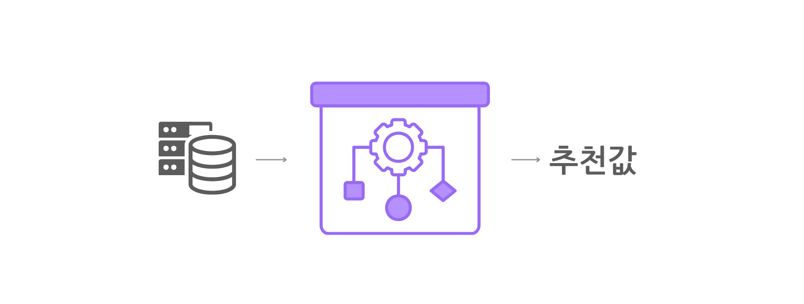
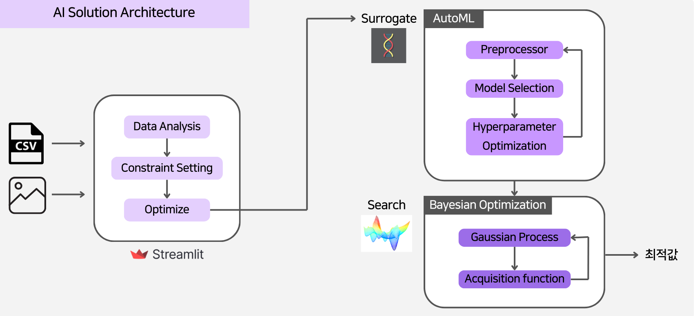
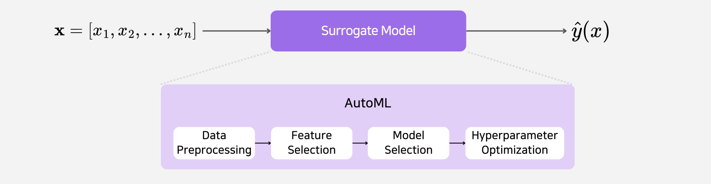
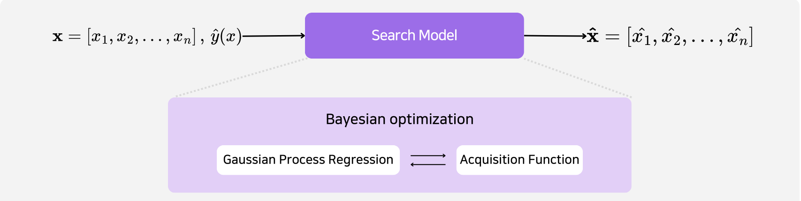
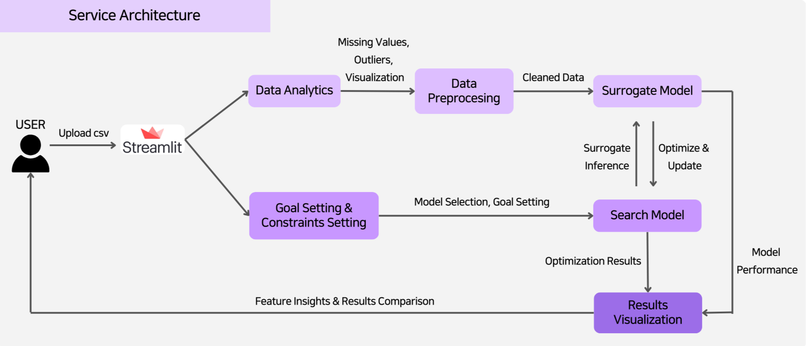

## 1️⃣ Introduction
**AutoML**과 **Prescriptive AI**를 활용하여 고객이 제공한 데이터를 분석하고, 최적의 추천 값을 제안하는 AI 솔루션을 개발하였습니다.

### 1.1 Key Objectives


- **자동화된 의사결정 최적화**

  AutoML을 활용하여 최적의 모델을 자동 학습하고 데이터 분석을 효율적으로 수행합니다.  

- **비용 절감 및 생산성 향상**

  분석 시간 단축 및 파이프라인 자동화를 통해 운영 비용을 절감하고 효율성을 높입니다.  

- **다양한 산업 적용 가능**

  헬스케어, 금융, 제조 등 다양한 산업에 적용할 수 있는 유연한 AI 솔루션을 제공합니다.  

---

## 2️⃣ Model Architecture
본 프로젝트에서는 **유전 알고리즘 기반 AutoML 라이브러리**를 구축하여 가장 예측력이 높은 **Surrogate Model**을 찾고, **Bayesian Optimization**을 활용하여 고객의 목적에 맞는 최적의 의사결정을 도출하였습니다.  

전체 서비스는 **Streamlit**을 통해 구현하였습니다.

### 2.1 AI Solution Architecture


### 2.2 Project Tree

```
level4-cv-finalproject-hackathon-cv-02-lv3
│  ├─ Service
│  │  ├─ Home.py
│  │  ├─ pages
│  │  │  ├─ 1_Data_Analysis.py
│  │  │  ├─ 2_AI_Solution.py
│  │  │  ├─ 3_Model_Training.py
│  │  │  ├─ 4_Results.py
│  │  ├─ utils
│  │  │  ├─ data_utils.py
│  ├─ Search
│  │  ├─ search.py
│  │  ├─ custom_bayes.py
│  │  ├─ search_concave.py
│  ├─ Surrogate
│  │  ├─ aisolution.py
│  ├─ autoML
│  │  ├─ autoML.py
│  │  ├─ metrics.py
│  │  ├─ pipeline_utils.py
│  ├─ assets
│  ├─ README.md
│  ├─ requirements.txt
```

---

## 3️⃣ Model Components

### 3.1 Surrogate Model


- **AutoML 기반 모델 학습**  
  - 데이터 전처리, 피처 선택, 모델 선택, 하이퍼파라미터 최적화 자동 수행  
  - 다양한 데이터셋에서 일관된 성능을 보장하는 모델 구축  

### 3.2 Search Model


- **Gaussian Process Regression**  
  - 주어진 데이터로부터 확률적 예측 모델을 생성  
- **Acquisition Function**  
  - 최적의 x를 찾기 위해 평가해야 할 데이터 포인트를 결정  
  - Bayesian Optimization을 통해 효율적인 탐색 진행  

---


## 4️⃣ How to Run

### 4.1 Install Required Libraries

```
pip install -r requirements.txt
```

### 4.2 Run Streamlit

Streamlit을 활용하여 UI를 제공하며, 사용자는 CSV 파일을 업로드하여 데이터를 분석하고 최적의 AI 솔루션을 탐색할 수 있습니다.

아래 **Service Architecture**를 통해 전체적인 프로세스를 확인할 수 있습니다.


**How to Run:**
```
streamlit run Service/Home.py
```

---

## 5️⃣ Demo


---

## 6️⃣ Memebers

<div align='center'>
  <h3>LuckyVicky🍀</h3>
  <table width="98%">
    <tr>
      <td align="center" valign="top" width="15%"><a href="https://github.com/Soojeoong"></a></td>
      <td align="center" valign="top" width="15%"><a href="https://github.com/jinlee24"></a></td>
      <td align="center" valign="top" width="15%"><a href="https://github.com/stop0729"></a></td>
      <td align="center" valign="top" width="15%"><a href="https://github.com/yjs616"></a></td>
      <td align="center" valign="top" width="15%"><a href="https://github.com/sng-tory"></a></td>
      <td align="center" valign="top" width="15%"><a href="https://github.com/cyndii20"></a></td>
    </tr>
    <tr>
      <td align="center">김소정</td>
      <td align="center">이동진</td>
      <td align="center">정지환</td>
      <td align="center">유정선</td>
      <td align="center">신승철</td>
      <td align="center">서정연</td>
    </tr>
    <tr>
      <td align="center">팀장, Search 모델 실험, 웹 구현</td>
      <td align="center">AutoML 구현, 벤치마크 데이터셋 분석</td>
      <td align="center">Search 모델 구현, 목적함수 개발</td>
      <td align="center">Search 모델 구현, 목적함수 개발</td>
      <td align="center">웹 구현, 전체 프로세스 연결 및 최적화</td>
      <td align="center">AutoML 구현, 벤치마크 데이터셋 분석</td>
    </tr>
  </table>
</div>

<p align='center'>© 2025 LuckyVicky Team.</p>
<p align='center'>Supported by Naver BoostCamp AI Tech 7th.</p>